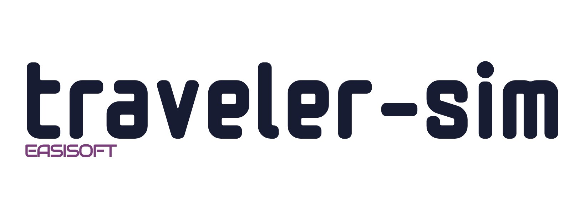

# Traveler

[](https://github.com/EasiSoft/traveler-sim/releases/latest)
[](https://github.com/EasiSoft/traveler-sim/blob/main/LICENSE.md)


C++ rocket simulation framework

## Features
*(to be finalized after release)*

## Requirements
- C++17 or later
- Tested with MSVC 19.3+, GCC 11+, Clang 13+

## Installation
Clone the repo and build with your preferred toolchain (tested with MSVC + Ninja):
```bash
git clone https://github.com/EasiSoft/traveler-sim.git
cd traveler-sim
cmake -B build
cmake --build build
```

## Usage

## License
Licensed under the MIT License. See [LICENSE](LICENSE) for details.
